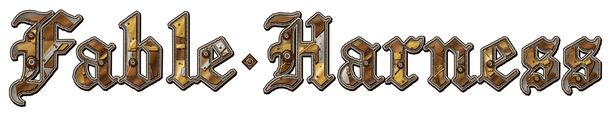
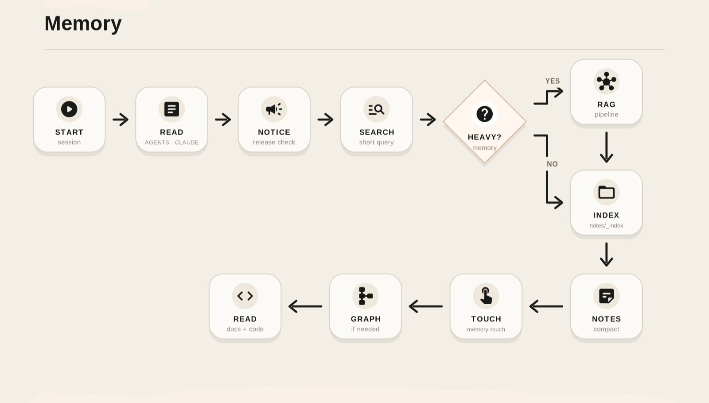
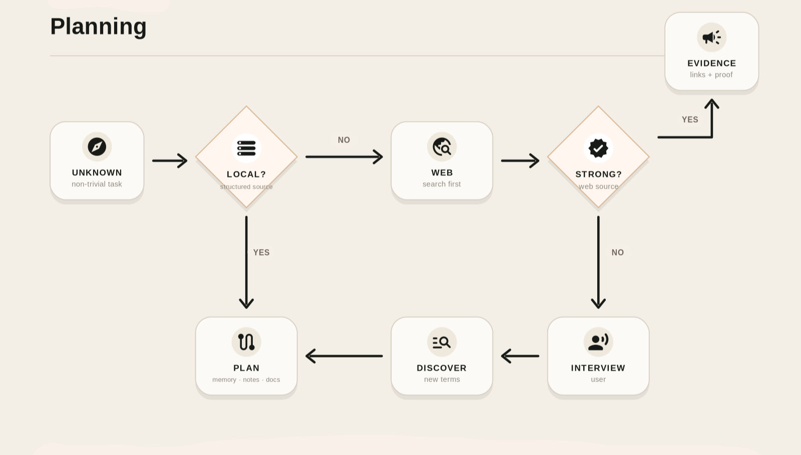
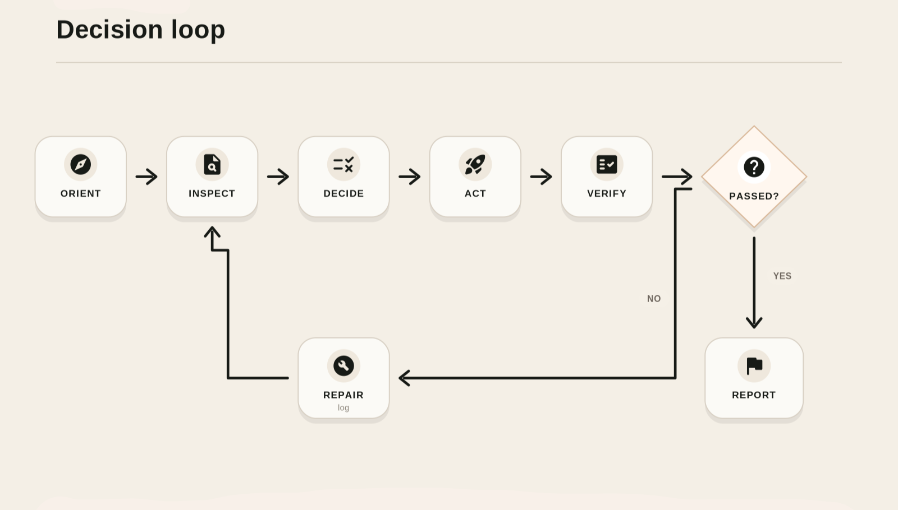
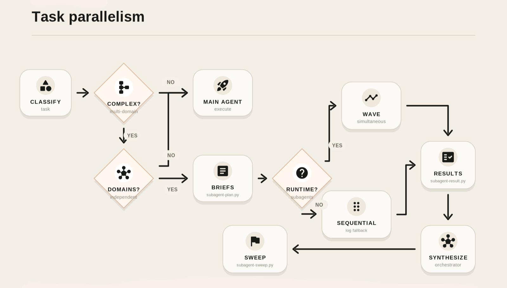
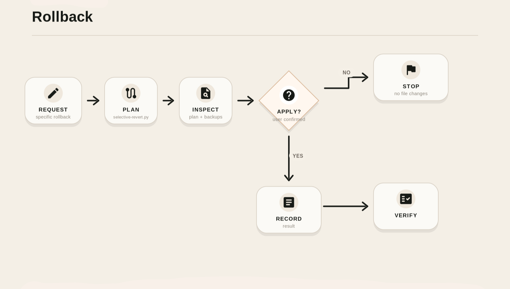

<p style="display: flex; justify-content: center; align-items: center; gap: 10px;">
  
  
</p>

<p align="center">
  <strong>Give AI agents a local operating system for memory, planning, verification, and rollback.</strong>
</p>

<p align="center">
  <a href="https://github.com/aao-sh/fable-harness"></a>
  <a href="https://github.com/aao-sh/fable-harness/stargazers"></a>
  <a href="https://github.com/aao-sh/fable-harness/forks"></a>
  <a href="LICENSE"></a>
  <a href="https://github.com/aao-sh/fable-harness/commits/main"></a>
  </br>
  <a href="https://www.npmjs.com/package/@aao-sh/fable-harness"></a>
  <a href="https://www.npmjs.com/package/@aao-sh/fable-harness"></a>
  <a href="https://pypi.org/project/fable-harness/"></a>
  <a href="https://pypi.org/project/fable-harness/"></a>
  </br>
  <a href="https://github.com/aao-sh/fable-harness/actions/workflows/publish-package.yml"></a>
  <a href="#benchmark"></a>
  </br></br>
  <a href="https://fable.aao.sh"></a>
  <a href="https://telegram.aao.sh"></a>
  <a href="https://discord.aao.sh"></a>
</p>

<hr />

Fable Harness installs a project-local control layer for AI coding agents. It gives Codex, Claude Code, and compatible agents a repeatable way to remember project decisions, plan work, run decision loops, delegate safely, verify results, and roll back specific changes without turning your repository into hidden chat state.

## Install

### by prompt

Ask your agent to install it in the current workspace:

```text
Install the Fable-Harness skill (https://github.com/aao-sh/fable-harness) and run it to set up this workspace.
```

The agent should handle the local project setup, choose the right surface, and run the installer with the workspace context already loaded.

<details>
<summary><span style="font-size: 1.25em; font-weight: bold;">manually</span></summary>

<aside style="color: #d9383a; font-weight: bold; border-left: 4px solid #d9383a; padding-left: 10px;">
  ⚠️ Fable Harness requires Python 3.9 or newer. The npm entry point can launch the installer, but the installer still runs Python under the hood.
</aside>
</br>

Check Python version:

```bash
python --version
```

<details>
<summary>Install Python if needed</summary>

  <details>
    <summary> for Windows</summary>

```powershell
  winget install Python.Python.3.12
```
  </details>

  <details>
    <summary> for macOS</summary>

```bash
  brew install python@3.12
```
  </details>

  <details>
    <summary> for Linux (Ubuntu/Debian)</summary>

```bash
  sudo apt update && sudo apt install python3.12
```
  </details>
</details>
</br>

Then use the package-manager entry point:

```bash
npx @aao-sh/fable-harness "./path/to/project" --agent auto
```

Or install into a workspace from this repository:

<aside style="color: #0284c7; border-left: 4px solid #0284c7; padding-left: 10px;">
  ℹ️ Use `--without-superpowers` to skip installing the Superpowers skill (not recommended).
</aside>

```bash
python "./scripts/install_fable_harness.py" "./path/to/project" --agent auto --with-superpowers
```

Agent targets:

| Target | Writes instructions to | Installs harness in |
|---|---|---|
| `codex` | `AGENTS.md` | `.codex/` |
| `claude` | `CLAUDE.md` | `.claude/` |
| `any` | `AGENTS.md` | `.agents/` |
| `both` | `AGENTS.md` and `CLAUDE.md` | all supported surfaces |
| `auto` | detects the workspace | detected surface |

</details>

## Why Use It

AI agents are strongest when their work is grounded in files, evidence, and repeatable checks. Fable Harness gives them that structure inside your project.

### Benefits

- Project-local memory instead of fragile chat-only context.
- Decision traces for audit-sensitive work.
- Semantic notes, RAG, and graph lookup for faster recall.
- A native decision loop: orient, inspect, decide, act, verify, report.
- Safer subagent planning for complex work.
- Protected TDD evidence and closure checks.
- Selective rollback plans instead of broad destructive resets.

## Main Workflows

<details>
<summary>Memory</summary>



Fable Harness stores durable project knowledge in compact semantic notes, not in raw chat history. Decision traces remain audit evidence, while generated memory shards, retrieval reports, and graph files make recall faster without making every future agent reread everything.

Use it when an agent needs to remember decisions, reload context, search prior work, promote trace evidence, or keep global/model memory from replacing project-local memory.

</details>

<details>
<summary>Planning</summary>



Planning starts from project evidence: instructions, notes, docs, source files, RAG citations, and graph orientation. If local sources are weak, the harness tells the agent to research before planning; if the task is still underspecified, it interviews the user before inventing requirements.

Use it to keep plans grounded, reviewable, and tied to real files.

</details>

<details>
<summary>Decision loop</summary>



The decision loop is the harness core: orient, inspect, decide, act, verify, report. Native loop scripts record events, transitions, checklist evidence, subagent waves, verification, repair attempts, and closure status.

Use it for non-trivial or mutating work where hidden process state would be risky.

</details>

<details>
<summary>Task parallelism</summary>



Fable Harness separates independent domains from dependent loop steps. Independent domains can become subagent waves; dependent steps stay ordered. This keeps parallel work fast without corrupting generated state, traces, memory, or verification order.

Use it when a task spans separate files, domains, or responsibilities that can progress independently.

</details>

<details>
<summary>Rollback</summary>



Rollback is selective and reviewable. The harness creates rollback plans, checkpoints, backups, and reverse patches before applying changes. It avoids broad destructive commands when the user only wants one file, hunk, or agent change reverted.

Use it when you need to undo specific work without erasing unrelated progress.

</details>

## Benchmark

This benchmark measures deterministic project control surfaces, not model quality. It compares an empty temporary workspace with the same workspace after installing Fable Harness.

Measured on: 2026-06-22T01:26:09+00:00

| Capability | Without Fable Harness | With Fable Harness |
|---|---:|---:|
| Capability checks passed | 0/10 | 10/10 |
| Installed scripts | 0 | 31 |
| Installed templates | 0 | 5 |
| Root agent instructions | no | yes |
| Install elapsed | n/a | 294 ms |

<details>
<summary>Benchmark details</summary>

| Check | Without | With |
|---|---:|---:|
| Root agent instructions | no | yes |
| Decision trace template | no | yes |
| Closure gate | no | yes |
| Memory search | no | yes |
| RAG pipeline | no | yes |
| Loop governance | no | yes |
| Subagent planning | no | yes |
| Selective rollback | no | yes |
| Code graph | no | yes |
| Memory dreaming | no | yes |

</details>

## Run The Benchmark

```powershell
python scripts/benchmark_readme.py --markdown
```

For machine-readable output:

```powershell
python scripts/benchmark_readme.py --json
```

## ✨ Acknowledgements

* **[Superpowers](https://github.com/obra/superpowers)**: Provides the skill framework that enables agents to run complex tasks.

* Special thanks to all community contributors who help maintain and support the project.

## 📚 References

### Frameworks, Playbooks & Workflow Design
* **Mark Kashef ([@MarkKashef](https://x.com/MarkKashef)):**
  * *The Fable Mindset Playbook*. Available at [Gumroad](https://markkashef.gumroad.com/l/fable-mindset).
  * *6 Dynamic Workflow Patterns for Claude Code*. Available at [Gumroad](https://markkashef.gumroad.com/l/dynamic-workflow-patterns).

### Knowledge Graphs & Semantic Memory
* **Alexander Shereshevsky ([Medium](https://medium.com/@shereshevsky)):**
  * *Your Obsidian Vault Is a Knowledge Graph. Here’s How to Make It Think (quickly)*. Published in Graph Praxis. Read on [Medium](https://medium.com/graph-praxis/your-obsidian-vault-is-a-knowledge-graph-heres-how-to-make-it-think-quickly-1487614a7682).
* **Skjæveland, M. G.; Balog, K.; Bernard, N.; Łajewska, W.; & Linjordet, T. (2024):**
  * *An ecosystem for personal knowledge graphs: A survey and research roadmap*. *AI Open*, Volume 5, Pages 55-69. Available via [ScienceDirect](https://www.sciencedirect.com/science/article/pii/S2666651024000044).

### Graph RAG Implementations
* **Oscar Campo ([@oscampo](https://github.com/oscampo)):**
  * *Neural Composer: Local Graph RAG made easy (LightRAG integration)*. Discussion and implementation framework available on the [Obsidian Forum](https://forum.obsidian.md/t/neural-composer-local-graph-rag-made-easy-lightrag-integration/109891).

</br></br>
<p style="display: flex; align-items: center; gap: 10px;">
  
  <span>
    Developed and maintained by the <a href="https://github.com/aao-sh/fable-harness/graphs/contributors">AAO.sh Community</a>.</br>
    Released under the <a href="LICENSE">MIT License</a>.
  </span>
</p>
